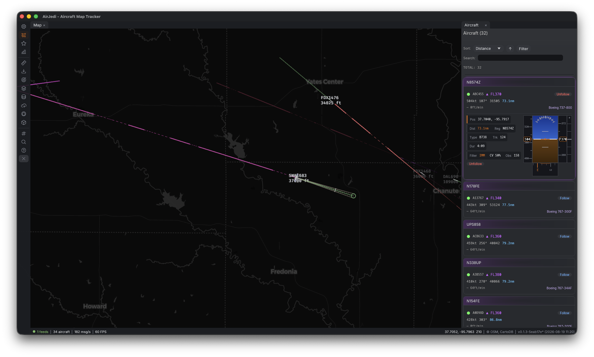

# AirJedi

A real-time aircraft tracker built with the [Bevy](https://bevyengine.org/) game engine. AirJedi renders live ADS-B aircraft positions on an interactive slippy map with support for both 2D and 3D views.



## Features

- **Live ADS-B tracking** - Connects to an SBS1/Beast feed and displays aircraft positions in real time
- **2D and 3D map views** - Seamless transitions between a flat slippy map and a perspective 3D view with atmosphere, sky, and terrain
- **Multiple basemap styles** - OpenStreetMap, ESRI satellite imagery, and more
- **Aircraft details** - Altitude-based coloring, flight trails, prediction lines, and detailed info panels
- **Aviation data overlays** - Airports, navaids, runways, and airspace boundaries
- **Day/night cycle** - Realistic sun and moon positioning based on time and location
- **Weather indicators** - METAR-based weather display
- **Flight recording** - Record and play back flight data
- **Dockable UI** - Tabbed panels for aircraft list, stats, debug info, and settings

## Protocol Support

AirJedi includes a built-in Mode-S/ADS-B decoder (the `adsb-client` crate) supporting two feed protocols. Multiple feeds can run simultaneously and aircraft data is merged by ICAO address.

### Feed Protocols

| Protocol | Port | Description |
|----------|------|-------------|
| **SBS-1 (BaseStation)** | 30003 | CSV text format, pre-decoded by dump1090/readsb |
| **BEAST Binary** | 30005 | Raw Mode-S frames with signal level and MLAT timestamps |

### Mode-S Downlink Formats

| DF | Name | Data Extracted |
|----|------|---------------|
| 0 | Short Air-Air (ACAS) | Altitude, ICAO from parity |
| 4 | Surveillance Altitude Reply | Altitude, flight status, ICAO from parity |
| 5 | Surveillance Identity Reply | Squawk code, flight status, ICAO from parity |
| 11 | All-Call Reply | ICAO address (populates known-aircraft set) |
| 16 | Long Air-Air (ACAS) | Altitude, ICAO from parity |
| 17 | ADS-B Extended Squitter | Full ADS-B (see type codes below) |
| 18 | ADS-B Non-Transponder / TIS-B | Same as DF=17 (ADS-R, TIS-B) |
| 19 | Military Extended Squitter | ICAO extraction (payload not decoded) |
| 20 | Comm-B Altitude Reply | Altitude, flight status, BDS register decoding |
| 21 | Comm-B Identity Reply | Squawk, flight status, BDS register decoding |

### ADS-B Type Codes (DF=17/18)

| TC | Message Type | Data |
|----|-------------|------|
| 1-4 | Aircraft Identification | Callsign, emitter category |
| 5-8 | Surface Position | Lat/lon (CPR), ground speed, track |
| 9-18 | Airborne Position (Baro) | Lat/lon (CPR), barometric altitude |
| 19 | Airborne Velocity | Ground speed + track (subtype 1/2), heading + airspeed (subtype 3/4), vertical rate |
| 20-22 | Airborne Position (GNSS) | Lat/lon (CPR), GNSS altitude |
| 28 | Aircraft Status | Emergency/priority status, squawk |

### BDS Registers (Comm-B Heuristic Decoding)

| BDS | Name | Data | Status |
|-----|------|------|--------|
| 2,0 | Aircraft Identification | Callsign | Supported |
| 5,0 | Track and Turn Report | Track, ground speed, TAS | Supported |
| 6,0 | Heading and Speed Report | Magnetic heading, IAS, Mach, vertical rate | Supported |
| 4,0 | Selected Vertical Intention | Selected altitude, baro setting | Not yet |
| 4,4 | Meteorological Routine | Wind, temperature, pressure, humidity | Not yet |

### BEAST Frame Types

| Type | Name | Status |
|------|------|--------|
| 0x31 | Mode-A/C | Skipped (no ICAO) |
| 0x32 | Mode-S Short (56-bit) | Supported (DF 0/4/5/11) |
| 0x33 | Mode-S Long (112-bit) | Supported (DF 16-21) |
| 0x34 | Status | Skipped (receiver-specific) |

## Requirements

- Rust (stable toolchain)
- macOS, Linux, or Windows
- An ADS-B data source (e.g., [readsb](https://github.com/wiedehopf/readsb) or [dump1090](https://github.com/flightaware/dump1090) with SBS-1 or BEAST output)

## Building and Running

```bash
# Debug build (faster compile, slower runtime)
cargo build
cargo run

# Release build (slower compile, faster runtime)
cargo build --release
cargo run --release
```

## macOS App Bundle

```bash
cd macos
make app    # Build AirJedi.app
make run    # Build and launch
```

## Configuration

Settings are persisted to a TOML config file and can be changed through the in-app settings panel. This includes basemap style, default map center, zoom level, and ADS-B connection settings.

## License

All rights reserved.
